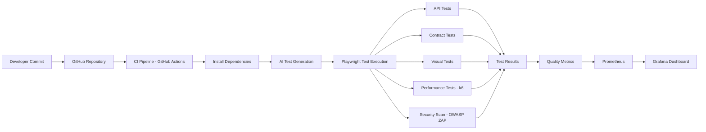

# 🚀 AI-Powered QA Quality Platform

A **modern QA automation platform** that demonstrates how Quality Engineering teams can combine
automation, artificial intelligence, performance testing, CI/CD pipelines, security validation,
and monitoring in a unified testing ecosystem.

This repository simulates a **real-world QA automation architecture** used by modern engineering
teams to ensure **continuous quality, scalability, and reliability** in software delivery.

---

# 🎥 Test Execution Demo

Place a recorded demo of the tests running in:

docs/tests-demo.gif

Then the README will automatically display it.

Example:

---

# 🧠 AI Test Generation from Swagger

One of the main features of this project is the ability to **generate automated tests using AI**
based on API definitions.

The AI module reads **Swagger / OpenAPI specifications** and automatically creates Playwright
test scenarios.

Benefits:

✔ Faster test development  
✔ Improved test coverage  
✔ Reduced manual effort  
✔ Scalable automation strategy  

Example workflow:

1. Swagger/OpenAPI file is parsed
2. AI analyzes API structure
3. Test cases are generated automatically
4. Playwright executes the generated tests

Command:

npm run ai-tests

---

# 🧩 QA Platform Architecture

This architecture simulates how **modern quality platforms operate inside engineering teams**.

---

# ✨ Key Features

### 🧪 API Test Automation
Automated API testing using **Playwright** to validate REST endpoints and responses.

### 📜 Contract Testing
Ensures API responses follow expected structures and properties.

### 👀 Visual Regression Testing
Detects unintended UI changes by comparing screenshots with baseline snapshots.

### 🤖 AI Generated Tests
Automatic test generation from Swagger/OpenAPI specifications.

### ⚡ Performance Testing
Load and performance testing using **k6**.

### 🛡 Security Testing
Automated security scans integrated in the pipeline using **OWASP ZAP**.

### 🔁 CI/CD Pipeline
Continuous Integration pipeline using **GitHub Actions**.

### 📊 Quality Monitoring Dashboard
Test metrics and system metrics visualized using **Grafana dashboards** powered by **Prometheus**.

---

# 📊 Quality Metrics Dashboard

The platform simulates a **quality observability layer**.

Metrics that can be tracked:

• Test pass/fail rate  
• API response times  
• Performance metrics  
• Error rate trends  
• Pipeline execution results  

These metrics are visualized in **Grafana dashboards**.

Access:

http://localhost:3000

---

# 🧰 Technology Stack

| Category | Technology |
|--------|-----------|
| Automation Framework | Playwright |
| Language | Node.js |
| AI Integration | OpenAI API |
| Performance Testing | k6 |
| Security Testing | OWASP ZAP |
| CI/CD | GitHub Actions |
| Monitoring | Grafana |
| Metrics | Prometheus |
| Containerization | Docker |

---

# 📂 Project Structure

ai-powered-qa-quality-platform

├── tests
│   ├── api
│   ├── contract
│   ├── visual
│   └── generated
│
├── ai
├── performance
├── monitoring
├── docker
├── api-schema
└── utils

This structure simulates how **large engineering teams organize QA platforms**.

---

# ▶ Running the Project

Install dependencies

npm install

Install Playwright browsers

npx playwright install

Run tests

npm test

---

# 🤖 Generate Tests with AI

npm run ai-tests

---

# ⚡ Run Performance Tests

npm run performance

---

# 📊 Start Monitoring

npm run monitoring

Grafana:

http://localhost:3000

---

# 🛡 Run Security Scan

Security validation using OWASP ZAP can be integrated in the CI pipeline to scan
application endpoints automatically.

Example concept:

zap-baseline.py -t https://target-url

---

# 🔁 CI/CD Pipeline

The CI pipeline automatically:

1. Installs dependencies
2. Generates AI tests
3. Executes Playwright automation
4. Runs performance tests
5. Executes security scanning
6. Publishes quality metrics

This simulates **Quality Gates used in modern DevOps environments**.

---

# 🎯 Project Purpose

This project demonstrates **modern Quality Engineering practices**, including:

✔ automation-first testing  
✔ AI-assisted test generation  
✔ performance validation  
✔ security testing  
✔ CI/CD integration  
✔ observability-driven quality  

The objective is to simulate a **production-grade QA automation platform**.

---

# 👀 For Recruiters

This repository demonstrates hands-on experience with **modern QA and Quality Engineering practices**.

Skills showcased:

✔ Test Automation Architecture  
✔ Playwright Automation Framework  
✔ API & Contract Testing  
✔ Visual Regression Testing  
✔ AI-assisted test generation  
✔ Performance Testing with k6  
✔ Security Testing (OWASP ZAP)  
✔ CI/CD pipelines with GitHub Actions  
✔ Observability with Grafana & Prometheus  

This project illustrates how a **complete QA platform can be designed and implemented**.

---

# 📌 Author

**Gilvando Matos**  
QA Automation Engineer / QA Lead  

🔗 LinkedIn:  
https://www.linkedin.com/in/gilvando-matos-3a259821/

---

# ⭐ Future Improvements

• Self-healing tests  
• AI-based bug detection  
• Advanced quality dashboards  
• Distributed performance testing
